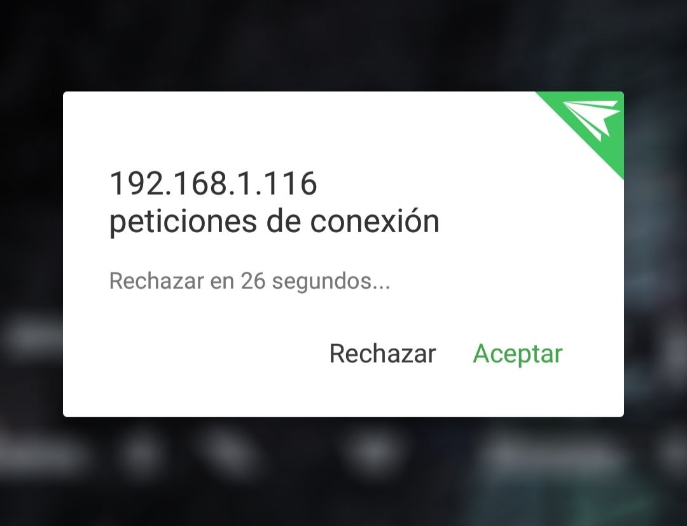
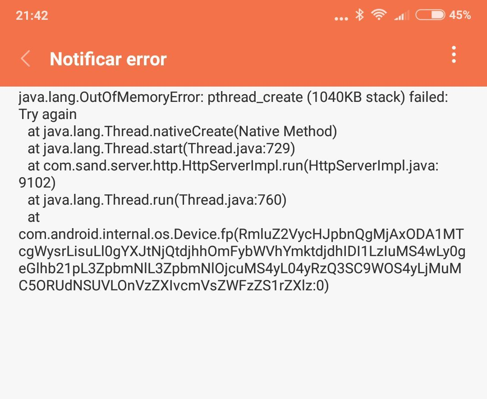

# AirDroidPwner

<p align="center">

</p>

¿Qué es AirDroid?
======

**AirDroid** es una de las herramientas más conocidas y utilizadas para controlar de forma remota un ordenador, concretamente a través del navegador.

¿Cómo funciona?
======

Para controlar y gestionar el dispositivo que sustenta el servicio, es necesaria una fase previa de aceptación por parte del cliente, donde figura un '**Message Box**' como el que se presenta a continuación:

<p align="center">

</p>

Una vez aceptada la conexión, el responsable de la sesión puede gestionar el dispositivo desde el navegador, pudiendo realizar las siguientes tareas entre otras:

* Visualizar la agenda de contactos
* Visualizar los SMS's recividos
* Visualizar el álbum multimedia [Vídeos, Imágenes, etc.]
* Enviar SMS's
* Añadir contactos
* Visualizar la pantalla del dispositivo móvil
* Navegar por los directorios
* Subir aplicaciones o contenidos al dispositivo
* Visualizar la cámara del dispositivo

¿En qué consiste la vulnerabilidad?
======

A pesar de no compartir el PoC que se encarga de bypassear la validación del lado del cliente, he compartido algunos scripts de utilidad para la extracción de información privilegiada una vez aceptada la conexión.

Así mismo, he compartido los scripts '**airdroid_dos.sh**' y '**airdroid_fast_dos.sh**', que se encargan de realizar una acción de tipo '**Remote DoS Application & System Crash**', donde por medio de estos se consigue hacer que el servicio corrompa remotamente, así como conseguir congelar el dispositivo móvil llenando toda la memoria hasta que se quede inoperativo:

<p align="center">

</p>

¿Cómo se utiliza el programa?
======

Comenzamos ejecutando el script '**AirDroidPwner.py**', donde será necesario proporcionar nuestra **KEY** de Shodan para encontrar un gran puñado de dispositivos con el servicio **AirDroid** corriendo:

```python
# Usa tu API KEY de Shodan
SHODAN_API_KEY = "xxxxxxxxxxxxxxxxxxxxxxxxxxxxxxxxxxxxxx"
api = shodan.Shodan(SHODAN_API_KEY)
```

La ejecución se hace de la siguiente forma:

```python
python AirDroidPwner.py
```

Como se aprecia, muy complejo. Tras su ejecución, a través de la API de Shodan en una primera instancia se almacenarán en un array todas las IP's que el propio Shodan indexa sobre la búsqueda realizada, en este caso del servicio AirDroid (puerto 8888).

Una vez encontradas, se lleva a cabo un proceso de validación para comprobar que realmente los Hosts encontrados cuentan con el servicio habilitado, atendiendo para ello al código de estado que devuelve la respuesta del lado del servidor tras realizar una simple petición.

Tras obtener el nuevo array con los elementos correspondientes a los Hosts activos, se ejecuta automáticamente el script '**AttackHost.py**', por donde se realizan peticiones de asociación contra cada uno de los Hosts almacenados.

Tras la aceptación de la conexión (esto es como el Phishing, la petición se lanza contra todos los Hosts y siempre alguno que otro la acepta, por desgracia [Toca Pescar...]), se almacena el identificador de la sesión en el parámetro **7bb**, desde el cual posteriormente se gestionan las consultas:

```python
def get_identifier(r_json):
        identifier_session = r_json["7bb"]
        return identifier_session
```

En caso de que el cliente no acepte la conexión, a través de un cómodo menú interactivo podremos llevar a cabo las siguientes operaciones:

* Remote DoS Application Crash
* Remote DoS System Crash

Donde haciendo uso de los '**Message Box**', a través de un bucle infinito con subbucles que realizan 3.000 peticiones en hilo, se consigue llenar la memoria RAM del dispositivo, causando no sólo una denegación de servicio remota del aplicativo sino también un **Remote System Crash**, donde el dispositivo queda completamente inoperativo forzando un reiniciado del sistema. 

Esta vulnerabilidad afecta no sólo a la última versión de AirDroid sino también a todas las que le preceden.
